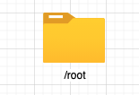
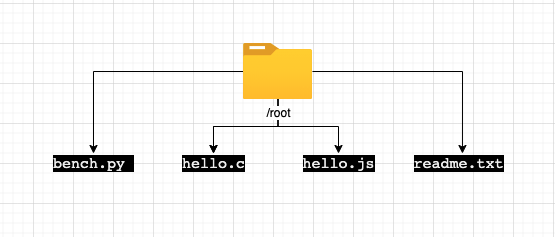
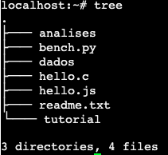
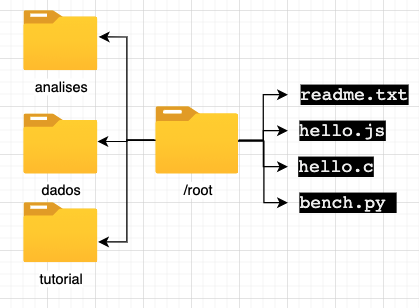
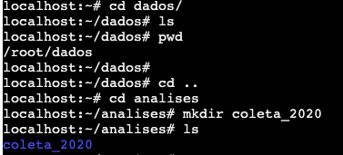
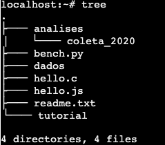
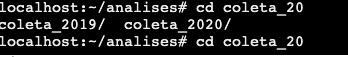

---
output:
    github_document:
    pandoc_args: --webtex
always_allow_html: true
---


<!-- README.md is generated from README.Rmd. Please edit that file -->

```{r, include = FALSE}
knitr::opts_chunk$set(
  collapse = TRUE,
  comment = "#>",
  fig.path = "imgs/",
  out.width = "100%"
)

knitr::opts_chunk$set(echo = TRUE)
```


<!-- badges: start -->


<!-- badges: end -->

# 🇧🇷 Comandos básicos em Unix! 

<font size=6> 🇪🇸 Comandos básicos en Unix! </font>

**Autor:** 
👩🏻‍💻👩🏻‍🔬 MSc. Kelly J. Hidalgo Martinez

Microbióloga

Doutoranda em Genética e Biologia Molecular

Instituto de Biologia - UNICAMP

📱 Whastapp: +5519981721510

📧 Email: khidalgo@javeriana.edu.co


# UNIX Shell

🇧🇷 O shell do Unix é um interpretador da linha de comando. É uma ferramenta poderosa que permite aos usuários executar tarefas complexas e poderosas, geralmente com algumas linhas de código.Em este tutorial, você vai entrar na "telinha preta" 🖥 e vai aprender e exercitar alguns comandos básicos e indispensáveis, para navegar e se desenvolver no *terminal*.

> 🇪🇸 El shell de Unix es un interpretador de línea de comando. Es una herramenta poderosa que permite a los usuarios a ejecutar tareas complejas y poderosas, generalmente con algunas líneas de código.En este tutorial, usted va entrar en la "pantalla negra" 🖥 y va a aprender y ejercitar algunos comandos básicos e indispensables, para navegar y se desenvolver en el *terminal*.

---

# Introdução
Normalmente a interação do humano com o computador acontece por meio de um teclado e um mouse, interfaces gráficas, sistemas de reconhecimento de voz. O jeito mais comum de interagir é chamada de interface gráfica de usuário *(**G**raphical **U**ser **I**nterface)*. Quando se trabalha em um GUI, as ordens são dadas clicando com o mouse e usando interações orientadas por diferentes menús. Isso funciona muito bem para escalas pequenas, pois é muito intuitivo. Mas agora imagine que você precisa executar uma tarefa em mil arquivos em diferentes pastas, por exemplo, copiar a última linha de todos os arquivos e colá-las em um único arquivo. Vc pasaria horas (talvez dias) fazendo o processo e ainda poderia cometer erros. Aí é quando o shell é muito útil, já que por ser uma interface de linha de comando *(**C**ommand **L**ine **I**nterface*)* e uma linguagem de srcipt, permite processar tarefas repetitivas como as do exemplo, sendo feitas de forma rápida e automática. O uso do shell é fundamental para o uso de uma ampla variedade de ferramentas ⚒ de bioinformática 🖥. Este tutorial vai servir para você fazer um uso eficaz desses recursos.

> # 🇪🇸  Introducción
Normalmente la interacción del humano con el computador sucede por medio de un teclado e un mouse, interfaces gráficas, sistemas de reconocimiento de voz. La manera más comúm de interacturar es llamada como interface gráfica de usuário *(**G**raphical **U**ser **I**nterface)*. Cuando se trabaja en una GUI, las ordenes son dadas haciendo click con el  mouse y usando interaciones orientadas por diferentes menús. Eso funciona mucho bien para escalas pequeñas, pues es muy intuitivo. Pero ahora imagine que usted necesita ejecutar una tarea en mil archivos en diferentes carpetas, por ejemplo, copiar la última línea de todos los archivos y pegarlos en un único archivo. Serían necesarias muchas horas (tal vez dias) ejecutando el proceso y además podría cometer errores. Es ahí cuando shell es muy útil, ya que por ser una interface de línea de comando *(**C**ommand **L**ine **I**nterface*)* y un lenguaje de srcipt, permite procesar tareas repetitivas como las del ejemplo, siendo realizadas de una forma rápida y automática. El uso de shell es fundamental para el uso de uma amplia variedad de herramientas ⚒ de bioinformática 🖥. Este tutorial le va s servir para hacer un uso eficaz de estos recursos.


**Nota**

* Sempre que você veja uma caixa como esta 👇🏼, é para você digitar o conteúdo na linha de comando e pressionar [enter] ⌨️ para **"rodar"** o comando.

> 🇪🇸 **Nota**
>
> * Siempre que ud vea una casa como ésta 👇🏼, es para usted digitar el contenido en la línea de comando e presionar [enter] ⌨️ para **"correr"** el comando.  

```{bash eval=FALSE, include=TRUE}
ls
```


**Nota**

* As vezes a caixa **NÃO** é um comando e sim a saída do comando, ou seja ou que você deveria ver na sua tela, após rodar o comando. Será avisado como **output**

> 🇪🇸 **Nota**
> 
> * Cuando la caja **NO** comienza con `$`, entonces se trata de la salida del comando, es decir lo que ud deberia ver en su pantalla después de correr el comando. 

```
Desktop   Downloads   Pictures    Documents   Library
```
---

# Vamos lá :beginner:
> 🇪🇸 Comecemos! 

* Usuário Linux ou Mac, consegue trabalhar diretamente pelo terminal.

* Usuário Windows, precisa trabalhar desde um *emulador* do terminal, como por exemplo [Putty](https://www.chiark.greenend.org.uk/~sgtatham/putty/latest.html) ou o app de Google Chrome [*Secure Shell App*](https://chrome.google.com/webstore/detail/secure-shell-app/pnhechapfaindjhompbnflcldabbghjo?hl=pt-BR), para se conectar com um servidor via `ssh`.

* Por enquanto é possível desenvolver o conteúdo deste tutorial usando um servidor público, [aqui](https://bellard.org/jslinux/vm.html?url=alpine-x86.cfg&mem=192)

> 🇪🇸
> 
> * Usuarios Linux o Mac, consiguen trabajar directamente por el terminal.
>
> * Usuarios Windows, necesitan trabajar desde un *emulador* del terminal, como por ejemplo [Putty](https://www.chiark.greenend.org.uk/~sgtatham/putty/latest.html) o la app de Google Chrome [*Secure Shell App*](https://chrome.google.com/webstore/detail/secure-shell-app/pnhechapfaindjhompbnflcldabbghjo?hl=pt-BR), para conectarse con un servidor via `ssh`. 
>
> * Por ahora es posible desarrollar el contenido de este tutorial usando un servidor público, [aqui](https://bellard.org/jslinux/vm.html?url=alpine-x86.cfg&mem=192)

### `ssh`

O `ssh` (Secure Shell) é um protocolo que garante que o usuário e o servidor remoto troquem informações de maneira segura e dinâmica. Ele serve especificamente para se conectar a um servidor. 

> 🇪🇸
>
> `ssh` (Secure Shell) es un protocolo que garantiza que el usuario y elservidor remoto intercambien informaciones de manera segura e dinámica. Sirve especificamente para conectarse a un servidor remoto. 

```
$ ssh -X <user_name>@<ip.address>
```

### `pwd` (*Print Working Directory*)

Os diretórios 📁 são como caixinhas. Sempre que você está usando o shell, você está dentro de alguma caixinha **(Diretório)** 📁 de seu computador 💻 ou servidor, chamado **diretório de trabalho atual**. Os comandos somente lêem e gravam arquivos no diretório de trabalho atual (se você não indicar outro caminho), portanto, é **importante** :exclamation: saber onde você está antes de executar um comando. `pwd` mostra onde você está.

> 🇪🇸
>
> Los directorios 📁 son como cajas. Siempre que usted está usando el shell, usted está dentro de alguna caja **(Directorio)** 📁 de su computador 💻 o servidor, llamado **directorio de trabajo actual**. Los comandos solamente leen y graban archivos en el directorio de trabajo actual (sí usted no indicar otro camino), por lo tanto, es **importante** :exclamation: saber en cual directorio está antes de ejecutar un comando. `pwd` muestra donde está.

```
pwd
```
**Output**
```
 /root
```

Se você estivesse usando a interfaz gráfica, então você estaria dentro da pasta raiz `/root`.

> 🇪🇸
>
> Sí usted  estuviese usando la interfase gráfica, entonces ud estaria dentro del directorio raiz `/root`.



Na figura se mostra graficamente o output do comando `pwd`.

> 🇪🇸 La figura muestra graficamente el output del comando `pwd`.

### Sintaxe dos comandos

`comando [opção] [arquivo]`

O comando é separado das opções (ou argumentos, flags) e do arquivo 📄 por um espaço. Os argumentos podem mudar o comportamento do comando. E o arquivo 📄 fala pro comando sobre o que vai a operar (p.e. arquivos 📄 e diretórios 📁). As vezes argumentos e o arquivo 📄 são chamados de **parâmetros**. Um comando pode ter mais de um argumento e/ou arquivos 📄 e também poderia não ter nemhum dos dois. As opções usualmente tem um traço e uma letra (p.e. `-h`) ou dois traços e uma palavra (p.e. `--help`), **sem** espaço entre o(s) traço(s) e a letra/palavra. Vamos ver com exemplos práticos.

**Importante:**:exclamation: a linguagem usada no UNIX é sensível a letras maiúsculas e minúsculas (*case sensitive*), é um erro comúm. **Fique atento sempre**:exclamation:

> 🇪🇸
> 
> El comando es separado de las opciones (o argumentos, flags) e do archivo 📄 por un espacio. Los argumentos pueden mudar el comportamiento del comando. Y el archivo 📄 indica para el comando sobre lo que va a operar (p.e. archivos 📄 y directorios 📁). A veces los argumentos y el archivo 📄 son llamados de **parámetros**. Un comando puede tener más de un argumento y/o archivos 📄 y también podria no tener ninguno de los dos. Las opciones usualmente tienen un guión y una letra (p.e. `-h`) o dos guiones y una palabra (p.e. `--help`), **sin** espacio entre lo(s) guion(es) y la letra/palabra. Vamos a ver con ejemplos prácticos.
>
> **Importante:**:exclamation: el lenguaje usado en UNIX es sensible a letras mayúsculas e minúsculas (*case sensitive*), es un error común. **Siempre atento**:exclamation
  
### `ls` Listar


Com o comando `ls` você pode ver (listar) o que tem dentro do **diretório atual de trabalho** 📁 

> 🇪🇸
> 
> Con el comando `ls` ud puede ver (listar) lo que hay dentro del **directorio actual de trabajo** 📁.
  
```
ls 
```

**Output**
```
bench.py    hello.c     hello.js    readme.txt
```

Se você estiver usando o servidor público que foi indicado, esse seria o resultado. Dentro da pasta `/root` estão os arquivos `bench.py hello.c hello.js readme.txt`.

> 🇪🇸
> 
> Sí ud está usando el servidor público que fue indicado, ese sería el resultado. Dentro del directorio `/root` están los archivos `bench.py hello.c hello.js readme.txt`.

Graficamente:



Vocẽ pode usar o **argumento** `-F` para indicar para o comando `ls` que mostre o que é cada elemento (diretório ou arquivo). `/` significa que é uma pasta 📁, o `*` qué um executável e se não tiver simbolo nenhum significa é uma arquivo 📄.

O ***flag*** 🚩 `--help` 🆘 é bem importante:exclamation:, e ele pode ser usado em **qualquer** comando. Ele mostra mais informação sobre o comando, e como usar ele 🤙🏼. Explore o menu help.


> 🇪🇸
> 
> Usted puede usar el **argumento** `-F` para indicar para el comando `ls` que muestre lo que es cada elemento (directorio o archivo). `/` significa que es un directorio 📁, el `*` significa que es un archivo ejecutable y sí no tiene ningún símbolosignifica que es un archivo 📄.
>
> El ***flag*** 🚩 `--help` 🆘 es bien importante:exclamation:, y puede ser usado en **cualquier** comando. El muestra más información sobre el comando, y como usarlo 🤙🏼. Explore o menú help

Outros **flags** 🚩 interessantes são: `ls -l`, que lista o conteúdo da pasta 📁 com informações extras, como as permisões, o tamanho, a data 📅 e hora 🕙 de criação, e o nome de cada um dos elementos. `ls -a` que lista todos os arquivos incluídos os ocultos. `ls -t` lista os arquivos em ordem cronolôgica. 

> 🇪🇸
> 
> Otros **flags** 🚩 interesantes son: `ls -l`, que lista el contenido de la carpeta 📁 con informaciones extras, como los permisos, el tamaño, la fecha 📅 y hora 🕙 de creación, y el nombre de cada uno de los elementos.`ls -a` que lista todos los archivos incluídos los ocultos. `ls -t` lista los archivos en orden cronológica. 

```
ls -l
```

**Output**
```
-rw-r--r--    1 root     root           114 Jul  5  2020 bench.py
-rw-r--r--    1 root     root            76 Jul  3  2020 hello.c
-rw-r--r--    1 root     root            22 Jun 26  2020 hello.js
-rw-r--r--    1 root     root           151 Jul  5  2020 readme.txt
```
**Permissões**
As permissões se devem entender assim:
d = diretório
rwx = *read, write* e *execute*
 Se deve ler de três em três caracteres. Assim, no nosso exemplo acima, nenhum dos elementos são diretorios porque não iniciam com a letra d. A primeira tripleta tem as letras r e w, ou seja o usuário pode ler e escrever esses elementos. A segunda tem somente a letra r, ou seja o grupo (podem ser criados grupos de usuários) só pode ler esses arquivos. Por último, a última tripleta, também só tem a letra r, ou seja **todos** os usuários só podem ler os elementos listados. 

> 🇪🇸
> 
> Los permisos se deben entender así:
> d = Directorio
> rwx = *read, write* y *execute*
> Se deben leer de tres en tres caracteres. Así, en nuestro ejemplo de arriba, ninguno de los elementos son directorios porque no inician con la letra d. La primera tripleta tiene las letras r e w, o sea el usuario puede leer y escribir esos elementos. La segunda tiene solamente la letra r, o sea el grupo (pueden ser creados grupos de usuarios) solo pueden leer esos archivos. Por último, la última tripleta, también solo tiene a letra r, o sea **todos** los usuarios solo pueden leer los elementos listados. 

### `mkdir` Make Dir

Você já aprendeu a explorar pastas 📁 e arquivos 📄, agora vai aprender como se criam eles. O comando `mkdir` serve para criar pastas 📁. Vamos criar várias 📁📁

> 🇪🇸
> 
> Usted ya aprendió a explorar carpetas 📁 y archivos 📄, ahora va a aprender como se crean. El comando `mkdir` sirve para crear carpetas 📁. Vamos a crear varias 📁📁

```
# Cria uma pasta chamada dados
mkdir dados
# Cria uma pasta chamada analises
mkdir analises tutorial
# Lista o conteúdo 
ls -F
```
**Output**
```
analises/   bench.py    dados/      hello.c     hello.js    readme.txt  tutorial/
```

Perceba que: 1) pode criar mais de uma pasta por linha de comando e 2) pode diferenciar o que é arquivo de pasta, pois as pastas estão de color azul e com uma `/` no final. 

> 🇪🇸
> 
> Note que: 1) puede crear más de una carpeta por línea de comando y 2) puede diferenciar los archivos de los directorios, pues éstos están de color azul y con una `/` al final.


Usando o comando `tree` você pode ver "graficamente" a organização dos diretórios e arquivos dentro do diretório atual. 

> 🇪🇸
> 
> Usando el comando `tree` puede ver "graficamente" la organización de los directorios y archivos dentro del directorio actual. 



Igual a:



#### *Tips* 
* Não 🚫 use espaços nos nomes de suas 📁 ou arquivos 📄 (p.e. ~~coleta 2020~~). Sempre separe as palavras com `-`, `_` ou com maiúsculas (p.e. `coleta_2020`, `coleta-2020` ou `coletaMaio` 👍🏼)
* Não 🚫 comece nomes com `-`
* Dê para seus elementos nomes facíes de lembrar e esrcever e que desrcevam o que contém.
* Não use caracteres espaciais :face_with_symbols_on_mouth:

> 🇪🇸
> 
> * No 🚫 use espacios en los nombres de sus carpetas 📁 o archivos 📄 (p.e. ~~coleta 2020~~). Siempre separe las palabras con `-`, `_` o con mayúsculas (p.e. `coleta_2020`, `coleta-2020` o `coletaMaio` 👍🏼)
>
> * No 🚫 comience nombres con `-`
> * Assigne para sus elementos nombres fáciles de recordar y esrcibir y que desrciban lo que contienen.
>
> * Não use caracteres espaciais :face_with_symbols_on_mouth:

### `cd` Change Directory

O comando `cd` serve para trocar de **diretório atual de trabalho** 📁.
Vai no diretório `dados/`
> 🇪🇸
> 
> El comando 'cd' sirve para cambiar de **directorio actual de trabajo** 📁. Vaya al directorio `dados/`

```
cd dados/
```
Confirme onde você está com o comando `pwd`

Para voltar ao diretório anterior...


> 🇪🇸
> 
> Condirme donde está con el comando `pwd`
>
> Para volver al directorio anterior

```
cd ..
```

O `..` significa diretório que contém o diretório atual (um diretório para cima). Confere com:


> 🇪🇸
> 
> El `..` significa: directorio que contiene el directorio actual (o sea un directorio arriba). Confirme con:

```
pwd
```
**Output**
```
/root/dados/
```
Agora entre na  pasta 📁 `analises/` e crie outra 📁 chamada `coleta_2020`, confira com `ls`

> 🇪🇸
> 
> Ahora entre en la carpeta 📁 `analises/` e crie otra 📁 llamada `coleta_2020`, confirme con `ls`

```
## Troque de pasta
cd analises/
## Crie a nova pasta
mkdir coleta_2020
## Confira
ls
```
**Output**
```
coleta_2020/
```

  
Agora entre na pasta que acabou de criar usando o comando `cd` e verifique onde você está com `pwd`, depois volte para sua pasta base `root/` 📁 e verifique novamente.

Ao finalizar esses comandos todos você deve obter uma organização de pastas assim:

> 🇪🇸
> 
> Ahora entre a la carpeta que acabó de crear usando el comando `cd` e verifique donde está con `pwd`, después regrese para el directorio base `root/` 📁 y verifique nuevamente.
>
> Al finalizar esos comandos ud deberá obtener una organización de carpetas así:



Por último volte para `/root/analises/coleta_2020` usando `cd` em uma linha só. Confirme con `pwd`. Volte novamente para pasta raiz em uma linha de comando só. **Dica**, lembre que `..` significa o diretório de cima. 

> 🇪🇸
> 
> Por último vuelva a la carpeta `root/analises/coleta_2020` usando `cd` en una línea de comando solamente. Confirme con `pwd`. Vuelva nuevamente para la carpeta raíz también con solo una línea de comando. **Pista**, recuerde que `..` significa directorio de arriba. 


#### *Dica* ️ 
Você pode usar a tecla Tab :keyboard: para autocompletar as palavras. Assim, economiza tempo ⏳, e evita erros de esrcita, porque o  sistema 💻 só vai completar nomes que existam no 📁 **diretório atual de trabalho**. 
Só tem que esrcever as primeiras letras da palavra, p.e col:

> 🇪🇸
> 
> Usted puede usar la tecla Tab :keyboard: para autocompletar las palabras. Así, economiza tiempo ⏳,  y evita errores de digitación , porque el sistema solo va a completar los nombres que existan en el **directorio actual de trabajo**.
>
> Solo tiene que esrcibir las primeras letras de la palabra. p.e. col:

```
## Troque de pasta
cd analises/col
```
Oprima :keyboard: [Tab]. Automaticamente se não existir nemhum outro elemento que comece por "col", vai ser completada a palavra coleta_2020.

> 🇪🇸
> 
> Oprima :keyboard: [Tab]. Automáticamente se no existe ningún otro elemento que comience por "col", la palabra coleta_2020 va a ser autocompletada. 

**Output**
```coffeesrcipt=
cd analises/coleta_2020
```
Se existir outro elemento que comece com "col" (p.e. coleta_2020, coleta_2019), você pode oprimir duas vezes Tab :keyboard: e o sistema 💻 vai mostrar as palavras com aquele começo.

> 🇪🇸
> 
> Sí por alguna razón existe otro elemento que también comience com "col", oprima dos vezes Tab "keyboard: e el sistema va a mostrar las opciones de palabras que inicien con "col".

```
## Estando em analises/ crie uma pasta chamada coleta_2019
 mkdir coleta_2019
```
Agora, você quer entrar nessa pasta nova. Use o comando `cd` para trocar de pasta e use [Tab] [Tab] para o sistema te mostrar as opções com o começo "col".

> 🇪🇸
> 
> Ahora, usted quiere entrar en esa pasta nueva. Use el comando `cd` para cambiar de carpeta y use [Tab] [Tab] para que el sistema muestre las opciones con cominzo "col".


```
cd col
```
[Tab] [Tab]





### `nano` (editor de texto)

**Sintaxe**
`nano <nome_do_arquivo>`

Agora você vai criar um arquivo 📄 `test.txt` dentro da pasta 📁 `tutorial/`.

> 🇪🇸
> 
> Ahora ud va a crear un archivo 📄 `test.txt` dentro de la carpeta 📁 `tutorial/`

```
## Troque de pasta
cd tutorial/
## Abra o editor de texto nano 
nano test.txt
```
Quando abrir o editor de texto, escreva: "Este é um teste" e feche o arquivo com [Ctrl + o] para gravar. Na linha branca embaixo o editor de texto perguntará se quer manter o nome que você deu no começo `test.txt`. [Enter] para confirmar. [Ctrl + x] para sair. Confira que o arquivo foi criado com o comando `ls`. 

Se vc quiser entrar de novo no arquivo e modificá-lo deve usar de novo o comando `nano test.txt`. 

> 🇪🇸
> 
> Cuando abrir el editor de texto, escriba: "Este es un test" y cierre el archivo con [Ctrl + o] para salvar. En la línea blanca abajo, el editor de texto preguntará sí quiere mantener el nombre que le dio al comienzo `test.txt`. [Enter] para confirmar. [Ctrl + x] para salir. confirme que el archivo fue creado con el comando `ls`.
>
> Sí ud quiere entrar de nuevo al arquivo y modificarlo, deve usar el de nuevo el comando `nano test.txt`. 

### `mv` move

O comando `mv` serve para mover arquivos 📄 de uma pasta 📁 a outra 📁. Além este comando também pode ser usado para mudar os nomes dos elementos.
Para mover um arquivo de uma pasta 📁 a outra 📁 a **sintaxe** do comando é: `mv arquivo.txt novapasta/`. Em nosso exemplo:

> 🇪🇸
> 
> El comando `mv` sirve para mover Archivos 📄 de una carpeta 📁 a otra 📁. Además este comando también puede ser usado para cambiar los nombres de los elementos.
Para mover un archivo de una carpeta 📁 a otra 📁 la **sintaxis** del comando es: `mv arquivo.txt novapasta/`. En nuestro ejemplo:

```
mv test.txt ../dados/
## Confira
ls ../dados/
```
Usou `../`, porque você estava dentro da pasta 📁`/root/tutorial/` e precisava voltar para 📁 `/root/` (📁 pasta acima da `tutorial/`) para continuar o caminho para 📁 `dados/`.

Agora use o comando `mv` para trocar o nome do arquivo 📄 `test.txt` por `prova.txt`. **Sintaxe** `mv nomedoarquivo.txt novonomedoarquivo.txt`

> 🇪🇸
> 
> Ud usó `../`, porque ud estaba dentro de la carpta 📁 `/root/tutorial/` y necesitaba volver para 📁 `/root/` (📁 carpta arriba de `tutorial/`) para continuar el camino para 📁 `dados/`.
>
> Ahora use el comando `mv` para cambiar el nombre del archivo 📄 `test.txt` por `prova.txt`. **Sintaxis** `mv nomedoarquivo.txt novonomedoarquivo.txt`


```
## Troque de pasta
cd ../dados/
## Confira
ls
```

**Output**
```
test.txt
```

```
## Mude o nome do arquivo
mv test.txt prova.txt
## Confira
ls
```

**Output**
```
prova.txt
```

### `cp` copy

O comando `cp` é similar ao `mv`, mas ele cópia o arquivo 📄 ao invés de mover ele. 
Agora vai copiar o arquivo `/root/dados/prova.txt` na pasta `/root/análises/`. **ATENCÃO:exclamation:! Vai fazer isso desde sua** 📁 **inicial** `/root/`.

> 🇪🇸
> 
> El comando `cp` es similar a `mv`, pero él copia el archivo 📄 en vez de moverlo. 
Ahora copie el archivo `/root/dados/prova.txt` en la carpeta `/root/análises/`. **ATENCIÓN:exclamation:! Haga eso desde el directorio inicial** `/root/`.

**Sintaxe**
`cp diretorio/nomedoarquivo.txt novodiretorio/nomedoarquivo.txt`

```
## Onde estou?
pwd
```
**Output**
```
/root/dados/
```
Não esqueça o **tip** 💁🏻‍♀️  de usar [Tab]

> 🇪🇸
> 
> No olvide del **tip** 💁🏻‍♀ de usar [Tab]


```
## Cópiar o arquivo
cp dados/prova.txt análises/
##Confira
ls dados/
```
**Output**
```
prova.txt
```

```
## Listar
ls análises/
```

**Output**
```
coleta_2019   coleta_2020   prova.txt
```
Você pode usar o comando `cp` para copiar vários arquivos 📄📄 em uma linha de comando só. 

> 🇪🇸
> 
> Ud puede usar el comando `cp` para copiar varios archivos 📄📄 en una línera de comando solamente. 

**Sintaxe**
`cp arquivo1.txt arquivo2.txt arquivo3.txt pasta/`


### `rm` remove
Com o comando `rm` você pode remover arquivos 📄 e/ou pastas📁. **CUIDADO!!**:exclamation: **PRECAUÇÃO**:exclamation: este comando não tem volta atrás, uma vez você oprima [enter] não tem como recuperar o arquivo 📄 ou pasta 📁, então revise e pense bem antes de rodar este comando. 
> 🇪🇸
> 
> Con o comando `rm` ud puede remover archivos 📄 y/o carpetas 📁. **CUIDADO**:exclamation: **PRECAUCIÓN**:exclamataion: este comando no tiene reversa, una vez ud oprima [enter] no hay como recuperar el archivo 📄 ou carpeta 📁, entonces revise y piense bien antes de rodar este comando.

**Sintaxe**

`rm diretorio/nomedoarquivo.txt`

Você vai deletar o arquivo `prova.txt` da pasta 📁 `/root/dados`. Se precisar, use o comando `pwd` para conferir em que pasta você está.

> 🇪🇸
> 
> Ud va a remover el archivo `prova.txt` de la carpeta 📁 `/root/dados`. Sí necesita, use el comando `pwd` para confirmar en que directorio está.

```
## Remover desde /root/
rm dados/prova.txt
## Confira
ls
```
**Output**
```

```

Para eliminar uma pasta 📁 você precisa do **flag** 🚩`-r`. Elimine a pasta 📁 `dados/`

```
## Remover a pasta
rm -r dados/
```

### Outros comandos
Para os seguintes comandos vamos criar dois novos arquivos de texto 📄📄 chamados `bssA_1.txt` e `bssA_2.txt`, em cada um vamos a colar uma sequência do gene *bssA* que codifica para a enzima *Benzylsuccinate synthase*. 

> 🇪🇸
> 
> Para los siguientes comando vamos a crear dos nuevos archivos de texto llamados `bssA_1.txt` y `bssA_2.txt`, en cada uno vamos a pegar una secuencia del gen *bssA* que codifica para la enzima *Benzylsuccinate synthase*.

```
## Trocar de pasta
cd tutorial/
##Abrir o editor de texto nano
nano bssA_1.txt
```
Copie a sequência [aqui](https://www.ncbi.nlm.nih.gov/nuccore/MW762608.1?report=fasta).
**Atenção:** O comando de teclas :keyboard: [Ctrl + V] não funciona no terminal de Linux. Use [Ctrl + Shift + V]. Se voce estiver no servidor público, use o click direito do mouse na caixinha abaixo da tela preta, onde fala: *Paste Here*, para copiar o texto. 

Salve e feche o editor. Se quiser pude conferir que o arquivo foi criado com o comando `ls`, e entrando no arquivo com o comando `nano` e o nome do arquivo.

> 🇪🇸
> 
> Copie la secuencia desde [aqui](https://www.ncbi.nlm.nih.gov/nuccore/MW762608.1?report=fasta).
>
> **Atención:** El comando de teclas :keyboard: [Ctrl + V] no funciona en el terminal de Linux. Use [Ctrl + Shift + V]. Sí usted está desde el servidor público, use el click derecho del mouse en la cajita abajo de la pantalla negra, donde dice: *Paste Here*, para copiar el texto. 
>
> Salve y cierre el editor. Sí quiere, puede confirmar que el archivo fue creado con el comando `ls`, y entrando en el archivo con el comando `nano` e el nombre del archivo.

```
## Abrir o editor de texto nano
nano bssA_1.txt
```
Repita o processo para criar o arquivo `bssA_2.txt` copiando esta [sequência](https://www.ncbi.nlm.nih.gov/nuccore/FJ810633.1?report=fasta)

> 🇪🇸
> 
> Repita el proceso para crear el archivo `bssA_2.txt` copiando ésta [secuencia](https://www.ncbi.nlm.nih.gov/nuccore/FJ810633.1?report=fasta).

### `less`
Este comando serve para imprimir na tela o conteúdo de um arquivo 📄 que cabe em uma tela só. Para sair digite `q`

> 🇪🇸
> 
> Este comando serve para imprimir en la pantalla el contenido de un archivo. Para salir digite `q`

```
less bssA_1.txt
```
Para sair [Ctrl + c]

### `head`
Mostra as primeiras 10 linhas do arquivo

```
head bssA_2.txt
```

### `tail`
Mostra as últimas 10 linhas do arquivo

```
tail bssA_2.txt
```

Se você quiser aumentar o número de linhas que esses dois últimos comandos mostram você pode adicionar um argumento com o número de linhas que quer imprimir na tela.

> 🇪🇸
> 
> Sí ud quiere, puede aumentar el número de líneas que esos dos últimos comandos muestran, adicionado un argumento con el número de líneas que desee imprimir en la pantalla.

```
## Últimas 12 linhas
tail -12 bssA_1.txt
## Primeiras 13 linhas
head -13 bssA_2.txt
```

### `cat` concatenate
Este comando serve para juntar dos 📄 📄 arquivos num só. Muito útil para juntar arquivos 📄 `.fasta` com sequencias. 

> 🇪🇸
> 
> Este comando sirve para juntar dos archivos en uno. Es muy útil para juntar archivos tipo `.fasta` con secuencias.

```
## Concatenar
cat bssA_1.txt bssA_2.txt > bssA_all.txt
## Confira
ls
```
No exemplo anterior, foram concatenados os arquivos `bssA_1.txt` e `bssA_2.txt` dentro do arquivo `bssA_all.txt`.

> 🇪🇸
> 
> En el ejemplo anterior, fueran concatenados los archivos `bssA_1.txt` y `bssA_2.txt` dentro del archivo `bss_all.txt`. 

### `wc` Word count
Este comando serve para contar as linhas, palavras ou caracteres dos arquivos 📄.

> 🇪🇸
> 
> Este comando sirve para contar las líneas, palabras o caracteres de los archivos.

```
## Contar linhas, palavras e caracteres
wc bssA_1.txt
```
**Output**
```
28        36      1907 bssA_1.txt
```
Então, o arquivo 📄 `bssA_1.txt` tem 28 linhas, 36 palavras e 1907 caracteres.

### `grep`

Com o `grep` você pode procurar um padrão dentro de um arquivo 📄. Por exemplo num arquivo 📄 de sequencias `.fasta` cada sequencia começa com o simbolo `>` ou poderia procurar uma sequência de nucleótideos especifica (p.e. ATCTTGCA).

> 🇪🇸
> 
> Com o `grep` ud puede buscar un patrón dentro de un archivo. Por ejemplo en un archivo de secuencias `.fasta` cada secuencia comienza con el simbolo `>` o podria buscar una secuencia de nucleótidos específica (p.e. ATCTTGCA)

```
grep -c '>' bssA_2.txt

grep -c 'CGA' bssA_1.txt
```
o flag `-c` é para que o comando só mostre o número de linhas que fazem *match* com o que está sendo procurado. 

O `grep` tem vários flags diferentes, lembre-se que pode conhecer todos eles digitando `grep --help` para entrar no menu de ajuda do comando.

> 🇪🇸
> 
> El *flag* `-c` es para que el comando solo muestre el número de líneas que hacen *match* con lo que está siendo procurado. 
>
> El comando `grep` tiene varios *flags* diferentes, recuerde que puede conocer todos ellos digitando `grep --help` para entrar en el menú de ayuda del comando.
>

### `find`
Com o comando `find` você pode procurar arquivos 📄 com uma palavra chave.

> 🇪🇸
> 
> Con el comando `find` ud puede buscar archivos con una palabra clave.

```
## Procurar
find . -name '*.txt'
```
Leia o comando assim: procurar no **diretório atual de trabalho** (`.`) 📁 qualquer arquivo 📄  que termine com `.txt`. O simbolo `*` significa qualquer caracter. Se você escrever `bss*`, o sistema vai entender que você está interessado em qualquer elemento que comece com "bss".

> 🇪🇸
> 
> Lea el comando así: buscar en el ``directorio actual de trabajo` cualquier archivo que termine con `*.txt`. El simbolo `*` significa cualquier caracter. Sí ud escribe `bss*, el sistema va a entender que ud está interesado en cualquier elemente que comience con "bss".

**Output**
```
./bssA_1.txt
./bssA_2.txt
./bssA_all.txt
```
Você poderia procurar a palavra em qualquer pasta 📁 do pc modificando o comando. Procure todos os arquivos terminados em '.py' na pasta raíz `/root/`.

```
## Procurar
find ../ -name "*.py"
```

**Output**
```
../bench.py
```

Outros exemplos:

```
find ../dados/ -name 'prova*' #procura arquivos que começam com prova dentro da pasta /root/dados/
find ../dados/ -iname 'prova*' #igual mas ignora se é mauscúlas ou minuscúlas.
```

### `wget`

O comando `wget` serve para fazer *download* de arquivos 📄 na web e armazenar no 📁 **diretório atual de trabalho**, muito útil para descarregar bases de dados. 

> 🇪🇸
> 
> El comando `wget` sirve para hacer *download* de archivos en la web y almacenarlos en el **directorio actual de trabajo**, es muy útil para descargar bases de datos.

**Sintaxe**
```
wget https://enderecoweb.com
```

### `gzip`
Este comando é para compactar e descompactar arquivos 📄.

```
## Comprimir
gzip tutorial/*
```
Assim, o `gzip` compactou todos os arquivos que estão dentro de `tutorial/`. Use o comando `ls` para observar a nova extensão dos arquivos. 

> 🇪🇸
> 
> Así, el comando `gzip` compactó todos los archivos que están dentro de la carpeta `tutorial/`. Use el comando `ls` para observar la nueva extensión de los archivos. 

Para descompactar o comando é:

```
## Descomprimir
gzip -d tutorial/bssA_all.txt.gz
```

### Comandos útiis de Linux

```
df    # Mostra o espaço em disco
free -g     # info da memória
uname -a    # Mostra a informação da máquina
du -sh    # mostra o espaço usado em disco
du sh *     # mostra o espaço usado em disco por arquivos e/ou diretórios 
du -s * | sort -nr    # Mostra o espaço usado em disco por arquivos e/ou dirétorios ordenados por tamanho
top     # Mostra o top de consumidores de memoria e CPU 
who     # Mostra quem está logado no sistema
ps    # Mostra os processos rodando pelo usuário
ps -e     # Mostra todos os processos rodando no sistema
ps -o %t -p <pid>     # Mostra quanto tempo leva rodando um determinado proceso (pid)
kill <pid>    # Mata o processo
paste <arquivo1> <arquivo2> > <arquivo.saida>     # Junta linhas de arquivos e separa por tabs (muito últi para tabelas)
cmp <arquivo1> <arquivo2>     # Mostra em que os dois arquivos são idénticos
diff <arquivo1> <arquivo2>    # Mostra as diferenças entre os dois arquivos
csplit -f out fasta_batch "%^>%" "/^>/" "{*}"     # Divide um arquivo fasta em varios arquivos a cada '>' (cada nova sequência)

sort -k 2,2 -k 3,3n arquivo.in > arquivo.out    # ordena a tabela, a coluna 2 alfabeticamente e a coluna 3 numericamente, -k para coluna, -n para numerico
join -1 1 -2 1 <tabala1> <tabela2>    # Junta duas tabelas baseado nos números especificados das colunas. Da tabela1 a coluna 1 e da tabela 2 a coluna2. Se asume que as tabelas estão ordenadas.
``` 

### `screen`

O screen è uma aplicação desenvolvida para Linux, que tem como objetivo a multiplexação de terminais. Ou seja, ele divide o terminal físico em várias sessões virtuais. Funciona assim, se você trabalhar em uma sessão do terminal enquanto usa o `screen`, quando vc deligar o seu computador, a sessão ficará rodando e você poderá voltar acessar a ela.

> 🇪🇸
> 
> Screen es una aplicación desarrollada para Linx, que tiene como objetivo la multiplexación de temrinales. O sea, él divide el temrinal físico en varias sesiones virtuales. Funciona así, sí ud está trabajando en una sesión del terminal, usando screen, cuando apague su computador, la sesión continuará corriendo los procesos y ud podrá volver a acceder a ella. 


Para iniciar uma nova sessão de screen, é só digitar na linha de comando `screen`. Aparecerá um texto na tela, pode apertar [enter]. Desse jeito o sistema criará uma nova sessão virtual e o nome dessa sessão será asignado pelo sistema. No entanto, se você quiser pode dar o nome na sessão então deve começar com o seguiente comando:

> 🇪🇸
> 
> Para iniciar una nueva sesión de screen, es solo digitar en la línea de comando `screen`. Aparecerá un texto en la pantalla, puede apretar [enter]. De esa manera el sistema criará una neuva sesión virtual e el nombre de esa sesión será asignado por el sistema. Sin embargo, sí ud quiere puede darle un nombre a la sesión, para eso es necesario comenzar con el siguiente comando: 
```
screen -S mysesson
```

Para sair da sessão mantenha apertado [Ctrl], emseguida aperte [a] seguido de [d]. Para voltar na sessão use os seguintes comandos:
```
screen -ls # lista as sessões ativas
screen -r nomedasessão # entra na sessão desejada
```
Para eliminar a sessão aperte [Ctrl + d]

### Scripts simples de uma linha de comando

Para renomear muitos arquivos *.old a *.new. PAra testar primeito, susbtituia `do mv` por `do echo mv`. 

```
for i in *.input; do mv $i ${i/\.old/\.new}; done
for i in *\ *; do mv "$i" "${i// /_}"; done # Substitui espaços em nomes de arquivos por underscores
```

### `scp` Secure Copy Between Machines

`scp` é um comando que serve para copiar elementos entre o servidor e seu computador e viceversa.

**Sintaxe**
`scp source target`

Então, vamos supor que você quer copiar um arquivo que está no servidor para seu computador:
```
scp user@ip.adress:caminho/ao/arquivo.txt caminho/no/seu/pc
```
E se fosse ao contrário:
```
scp caminho/no/seu/pc/arquivo.txt user@ip.adress:caminho/onde/quer/copiar/no/servidor/
```
Se você quer copiar um diretório completo basta colocar o *flag* `-r` após `scp`

### Compressão e descompressão de arquivos

Além de `gzip`, existem outros tipos de compressão de arquivos, tais como `.tar` e `.zip`.

**Compressão**
```
tar -cvf arquivo.tar meudiretorio/ #comprime meudiretorio, e o nome do arquivo comprimido será arquivo.tar
zip -r meudiretorio.zip meudiretorio/ #comprime o diretório meudiretorio/ em um arquivo chamado meudiretorio.zip
```

**Visualizar**
```
tar -tvf arquivo.tar
```

**Extrair**
```
tar -xvf arquivo.tar
unzip meudiretorio.zip
```

**FIM**


