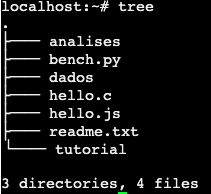
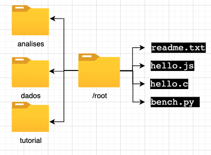
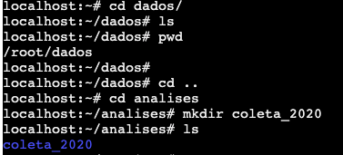

<!-- README.md is generated from README.Rmd. Please edit that file -->
<!-- badges: start -->


<!-- badges: end -->

# 🇧🇷 Comandos básicos em Unix! 

<font size=6> 🇪🇸 Comandos básicos en Unix! </font>

**Autor:** 👩🏻‍💻👩🏻‍🔬 MSc. Kelly J. Hidalgo Martinez

Microbióloga

Doutoranda em Genética e Biologia Molecular

Instituto de Biologia - UNICAMP

📱 Whastapp: +5519981721510

📧 Email: <khidalgo@javeriana.edu.co>

# UNIX Shell

🇧🇷 O shell do Unix é um interpretador da linha de comando. É uma
ferramenta poderosa que permite aos usuários executar tarefas complexas
e poderosas, geralmente com algumas linhas de código.Em este tutorial,
você vai entrar na “telinha preta” 🖥 e vai aprender e exercitar alguns
comandos básicos e indispensáveis, para navegar e se desenvolver no
*terminal*.

> 🇪🇸 El shell de Unix es un interpretador de línea de comando. Es una
> herramenta poderosa que permite a los usuarios a ejecutar tareas
> complejas y poderosas, generalmente con algunas líneas de código.En
> este tutorial, usted va entrar en la “pantalla negra” 🖥 y va a
> aprender y ejercitar algunos comandos básicos e indispensables, para
> navegar y se desenvolver en el *terminal*.

------------------------------------------------------------------------

# Introdução

Normalmente a interação do humano com o computador acontece por meio de
um teclado e um mouse, interfaces gráficas, sistemas de reconhecimento
de voz. O jeito mais comum de interagir é chamada de interface gráfica
de usuário *(**G**raphical **U**ser **I**nterface)*. Quando se trabalha
em um GUI, as ordens são dadas clicando com o mouse e usando interações
orientadas por diferentes menús. Isso funciona muito bem para escalas
pequenas, pois é muito intuitivo. Mas agora imagine que você precisa
executar uma tarefa em mil arquivos em diferentes pastas, por exemplo,
copiar a última linha de todos os arquivos e colá-las em um único
arquivo. Vc pasaria horas (talvez dias) fazendo o processo e ainda
poderia cometer erros. Aí é quando o shell é muito útil, já que por ser
uma interface de linha de comando *(**C**ommand **L**ine
**I**nterface*)\* e uma linguagem de srcipt, permite processar tarefas
repetitivas como as do exemplo, sendo feitas de forma rápida e
automática. O uso do shell é fundamental para o uso de uma ampla
variedade de ferramentas ⚒ de bioinformática 🖥. Este tutorial vai servir
para você fazer um uso eficaz desses recursos.

> # 🇪🇸 Introducción
>
> Normalmente la interacción del humano con el computador sucede por
> medio de un teclado e un mouse, interfaces gráficas, sistemas de
> reconocimiento de voz. La manera más comúm de interacturar es llamada
> como interface gráfica de usuário *(**G**raphical **U**ser
> **I**nterface)*. Cuando se trabaja en una GUI, las ordenes son dadas
> haciendo click con el mouse y usando interaciones orientadas por
> diferentes menús. Eso funciona mucho bien para escalas pequeñas, pues
> es muy intuitivo. Pero ahora imagine que usted necesita ejecutar una
> tarea en mil archivos en diferentes carpetas, por ejemplo, copiar la
> última línea de todos los archivos y pegarlos en un único archivo.
> Serían necesarias muchas horas (tal vez dias) ejecutando el proceso y
> además podría cometer errores. Es ahí cuando shell es muy útil, ya que
> por ser una interface de línea de comando *(**C**ommand **L**ine
> **I**nterface*)\* y un lenguaje de srcipt, permite procesar tareas
> repetitivas como las del ejemplo, siendo realizadas de una forma
> rápida y automática. El uso de shell es fundamental para el uso de uma
> amplia variedad de herramientas ⚒ de bioinformática 🖥. Este tutorial
> le va s servir para hacer un uso eficaz de estos recursos.

**Nota**

-   Sempre que você veja uma caixa como esta 👇🏼, é para você digitar o
    conteúdo na linha de comando e pressionar \[enter\] ⌨️ para
    **“rodar”** o comando.

> 🇪🇸 **Nota**
>
> -   Siempre que ud vea una casa como ésta 👇🏼, es para usted digitar el
>     contenido en la línea de comando e presionar \[enter\] ⌨️ para
>     **“correr”** el comando.

``` bash
ls
```

**Nota**

-   As vezes a caixa **NÃO** é um comando e sim a saída do comando, ou
    seja ou que você deveria ver na sua tela, após rodar o comando. Será
    avisado como **output**

> 🇪🇸 **Nota**
>
> -   Cuando la caja **NO** comienza con `$`, entonces se trata de la
>     salida del comando, es decir lo que ud deberia ver en su pantalla
>     después de correr el comando.

    Desktop   Downloads   Pictures    Documents   Library

------------------------------------------------------------------------

# Vamos lá :beginner:

> 🇪🇸 Comecemos!

-   Usuário Linux ou Mac, consegue trabalhar diretamente pelo terminal.

-   Usuário Windows, precisa trabalhar desde um *emulador* do terminal,
    como por exemplo
    [Putty](https://www.chiark.greenend.org.uk/~sgtatham/putty/latest.html)
    ou o app de Google Chrome [*Secure Shell
    App*](https://chrome.google.com/webstore/detail/secure-shell-app/pnhechapfaindjhompbnflcldabbghjo?hl=pt-BR),
    para se conectar com um servidor via `ssh`.

-   Por enquanto é possível desenvolver o conteúdo deste tutorial usando
    um servidor público,
    [aqui](https://bellard.org/jslinux/vm.html?url=alpine-x86.cfg&mem=192)

> 🇪🇸
>
> -   Usuarios Linux o Mac, consiguen trabajar directamente por el
>     terminal.
>
> -   Usuarios Windows, necesitan trabajar desde un *emulador* del
>     terminal, como por ejemplo
>     [Putty](https://www.chiark.greenend.org.uk/~sgtatham/putty/latest.html)
>     o la app de Google Chrome [*Secure Shell
>     App*](https://chrome.google.com/webstore/detail/secure-shell-app/pnhechapfaindjhompbnflcldabbghjo?hl=pt-BR),
>     para conectarse con un servidor via `ssh`.
>
> -   Por ahora es posible desarrollar el contenido de este tutorial
>     usando un servidor público,
>     [aqui](https://bellard.org/jslinux/vm.html?url=alpine-x86.cfg&mem=192)

### `ssh`

O `ssh` (Secure Shell) é um protocolo que garante que o usuário e o
servidor remoto troquem informações de maneira segura e dinâmica. Ele
serve especificamente para se conectar a um servidor.

> 🇪🇸
>
> `ssh` (Secure Shell) es un protocolo que garantiza que el usuario y
> elservidor remoto intercambien informaciones de manera segura e
> dinámica. Sirve especificamente para conectarse a un servidor remoto.

    $ ssh -X <user_name>@<ip.address>

### `pwd` (*Print Working Directory*)

Os diretórios 📁 são como caixinhas. Sempre que você está usando o shell,
você está dentro de alguma caixinha **(Diretório)** 📁 de seu computador
💻 ou servidor, chamado **diretório de trabalho atual**. Os comandos
somente lêem e gravam arquivos no diretório de trabalho atual (se você
não indicar outro caminho), portanto, é **importante** :exclamation:
saber onde você está antes de executar um comando. `pwd` mostra onde
você está.

> 🇪🇸
>
> Los directorios 📁 son como cajas. Siempre que usted está usando el
> shell, usted está dentro de alguna caja **(Directorio)** 📁 de su
> computador 💻 o servidor, llamado **directorio de trabajo actual**. Los
> comandos solamente leen y graban archivos en el directorio de trabajo
> actual (sí usted no indicar otro camino), por lo tanto, es
> **importante** :exclamation: saber en cual directorio está antes de
> ejecutar un comando. `pwd` muestra donde está.

    pwd

**Output**

     /root

Se você estivesse usando a interfaz gráfica, então você estaria dentro
da pasta raiz `/root`.

> 🇪🇸
>
> Sí usted estuviese usando la interfase gráfica, entonces ud estaria
> dentro del directorio raiz `/root`.


Na figura se mostra graficamente o output do comando `pwd`.

> 🇪🇸 La figura muestra graficamente el output del comando `pwd`.

### Sintaxe dos comandos

`comando [opção] [arquivo]`

O comando é separado das opções (ou argumentos, flags) e do arquivo 📄
por um espaço. Os argumentos podem mudar o comportamento do comando. E o
arquivo 📄 fala pro comando sobre o que vai a operar (p.e. arquivos 📄 e
diretórios 📁). As vezes argumentos e o arquivo 📄 são chamados de
**parâmetros**. Um comando pode ter mais de um argumento e/ou arquivos 📄
e também poderia não ter nemhum dos dois. As opções usualmente tem um
traço e uma letra (p.e. `-h`) ou dois traços e uma palavra (p.e.
`--help`), **sem** espaço entre o(s) traço(s) e a letra/palavra. Vamos
ver com exemplos práticos.

**Importante:**:exclamation: a linguagem usada no UNIX é sensível a
letras maiúsculas e minúsculas (*case sensitive*), é um erro comúm.
**Fique atento sempre**:exclamation:

> 🇪🇸
>
> El comando es separado de las opciones (o argumentos, flags) e do
> archivo 📄 por un espacio. Los argumentos pueden mudar el
> comportamiento del comando. Y el archivo 📄 indica para el comando
> sobre lo que va a operar (p.e. archivos 📄 y directorios 📁). A veces
> los argumentos y el archivo 📄 son llamados de **parámetros**. Un
> comando puede tener más de un argumento y/o archivos 📄 y también
> podria no tener ninguno de los dos. Las opciones usualmente tienen un
> guión y una letra (p.e. `-h`) o dos guiones y una palabra (p.e.
> `--help`), **sin** espacio entre lo(s) guion(es) y la letra/palabra.
> Vamos a ver con ejemplos prácticos.
>
> **Importante:**:exclamation: el lenguaje usado en UNIX es sensible a
> letras mayúsculas e minúsculas (*case sensitive*), es un error común.
> **Siempre atento**:exclamation

### `ls` Listar

Com o comando `ls` você pode ver (listar) o que tem dentro do
**diretório atual de trabalho** 📁

> 🇪🇸
>
> Con el comando `ls` ud puede ver (listar) lo que hay dentro del
> **directorio actual de trabajo** 📁.

    ls 

**Output**

    bench.py    hello.c     hello.js    readme.txt

Se você estiver usando o servidor público que foi indicado, esse seria o
resultado. Dentro da pasta `/root` estão os arquivos
`bench.py hello.c hello.js readme.txt`.

> 🇪🇸
>
> Sí ud está usando el servidor público que fue indicado, ese sería el
> resultado. Dentro del directorio `/root` están los archivos
> `bench.py hello.c hello.js readme.txt`.

Graficamente:


Vocẽ pode usar o **argumento** `-F` para indicar para o comando `ls` que
mostre o que é cada elemento (diretório ou arquivo). `/` significa que é
uma pasta 📁, o `*` qué um executável e se não tiver simbolo nenhum
significa é uma arquivo 📄.

O ***flag*** 🚩 `--help` 🆘 é bem importante:exclamation:, e ele pode ser
usado em **qualquer** comando. Ele mostra mais informação sobre o
comando, e como usar ele 🤙🏼. Explore o menu help.

> 🇪🇸
>
> Usted puede usar el **argumento** `-F` para indicar para el comando
> `ls` que muestre lo que es cada elemento (directorio o archivo). `/`
> significa que es un directorio 📁, el `*` significa que es un archivo
> ejecutable y sí no tiene ningún símbolosignifica que es un archivo 📄.
>
> El ***flag*** 🚩 `--help` 🆘 es bien importante:exclamation:, y puede
> ser usado en **cualquier** comando. El muestra más información sobre
> el comando, y como usarlo 🤙🏼. Explore o menú help

Outros **flags** 🚩 interessantes são: `ls -l`, que lista o conteúdo da
pasta 📁 com informações extras, como as permisões, o tamanho, a data 📅 e
hora 🕙 de criação, e o nome de cada um dos elementos. `ls -a` que lista
todos os arquivos incluídos os ocultos. `ls -t` lista os arquivos em
ordem cronolôgica.

> 🇪🇸
>
> Otros **flags** 🚩 interesantes son: `ls -l`, que lista el contenido de
> la carpeta 📁 con informaciones extras, como los permisos, el tamaño,
> la fecha 📅 y hora 🕙 de creación, y el nombre de cada uno de los
> elementos.`ls -a` que lista todos los archivos incluídos los ocultos.
> `ls -t` lista los archivos en orden cronológica.

    ls -l

**Output**

    -rw-r--r--    1 root     root           114 Jul  5  2020 bench.py
    -rw-r--r--    1 root     root            76 Jul  3  2020 hello.c
    -rw-r--r--    1 root     root            22 Jun 26  2020 hello.js
    -rw-r--r--    1 root     root           151 Jul  5  2020 readme.txt

**Permissões** As permissões se devem entender assim: d = diretório rwx
= *read, write* e *execute* Se deve ler de três em três caracteres.
Assim, no nosso exemplo acima, nenhum dos elementos são diretorios
porque não iniciam com a letra d. A primeira tripleta tem as letras r e
w, ou seja o usuário pode ler e escrever esses elementos. A segunda tem
somente a letra r, ou seja o grupo (podem ser criados grupos de
usuários) só pode ler esses arquivos. Por último, a última tripleta,
também só tem a letra r, ou seja **todos** os usuários só podem ler os
elementos listados.

> 🇪🇸
>
> Los permisos se deben entender así: d = Directorio rwx = *read, write*
> y *execute* Se deben leer de tres en tres caracteres. Así, en nuestro
> ejemplo de arriba, ninguno de los elementos son directorios porque no
> inician con la letra d. La primera tripleta tiene las letras r e w, o
> sea el usuario puede leer y escribir esos elementos. La segunda tiene
> solamente la letra r, o sea el grupo (pueden ser creados grupos de
> usuarios) solo pueden leer esos archivos. Por último, la última
> tripleta, también solo tiene a letra r, o sea **todos** los usuarios
> solo pueden leer los elementos listados.

### `mkdir` Make Dir

Você já aprendeu a explorar pastas 📁 e arquivos 📄, agora vai aprender
como se criam eles. O comando `mkdir` serve para criar pastas 📁. Vamos
criar várias 📁📁

> 🇪🇸
>
> Usted ya aprendió a explorar carpetas 📁 y archivos 📄, ahora va a
> aprender como se crean. El comando `mkdir` sirve para crear carpetas
> 📁. Vamos a crear varias 📁📁

    # Cria uma pasta chamada dados
    mkdir dados
    # Cria uma pasta chamada analises
    mkdir analises tutorial
    # Lista o conteúdo 
    ls -F

**Output**

    analises/   bench.py    dados/      hello.c     hello.js    readme.txt  tutorial/

Perceba que: 1) pode criar mais de uma pasta por linha de comando e 2)
pode diferenciar o que é arquivo de pasta, pois as pastas estão de color
azul e com uma `/` no final.

> 🇪🇸
>
> Note que: 1) puede crear más de una carpeta por línea de comando y 2)
> puede diferenciar los archivos de los directorios, pues éstos están de
> color azul y con una `/` al final.

Usando o comando `tree` você pode ver “graficamente” a organização dos
diretórios e arquivos dentro do diretório atual.

> 🇪🇸
>
> Usando el comando `tree` puede ver “graficamente” la organización de
> los directorios y archivos dentro del directorio actual.



Igual a:



#### *Tips*

-   Não 🚫 use espaços nos nomes de suas 📁 ou arquivos 📄 (p.e. ~~coleta
    2020~~). Sempre separe as palavras com `-`, `_` ou com maiúsculas
    (p.e. `coleta_2020`, `coleta-2020` ou `coletaMaio` 👍🏼)
-   Não 🚫 comece nomes com `-`
-   Dê para seus elementos nomes facíes de lembrar e esrcever e que
    desrcevam o que contém.
-   Não use caracteres espaciais :face\_with\_symbols\_on\_mouth:

> 🇪🇸
>
> -   No 🚫 use espacios en los nombres de sus carpetas 📁 o archivos 📄
>     (p.e. ~~coleta 2020~~). Siempre separe las palabras con `-`, `_` o
>     con mayúsculas (p.e. `coleta_2020`, `coleta-2020` o `coletaMaio`
>     👍🏼)
>
> -   No 🚫 comience nombres con `-`
>
> -   Assigne para sus elementos nombres fáciles de recordar y esrcibir
>     y que desrciban lo que contienen.
>
> -   Não use caracteres espaciais :face\_with\_symbols\_on\_mouth:

### `cd` Change Directory

O comando `cd` serve para trocar de **diretório atual de trabalho** 📁.
Vai no diretório `dados/` &gt; 🇪🇸 &gt; &gt; El comando ‘cd’ sirve para
cambiar de **directorio actual de trabajo** 📁. Vaya al directorio
`dados/`

    cd dados/

Confirme onde você está com o comando `pwd`

Para voltar ao diretório anterior…

> 🇪🇸
>
> Condirme donde está con el comando `pwd`
>
> Para volver al directorio anterior

    cd ..

O `..` significa diretório que contém o diretório atual (um diretório
para cima). Confere com:

> 🇪🇸
>
> El `..` significa: directorio que contiene el directorio actual (o sea
> un directorio arriba). Confirme con:

    pwd

**Output**

    /root/dados/

Agora entre na pasta 📁 `analises/` e crie outra 📁 chamada `coleta_2020`,
confira com `ls`

> 🇪🇸
>
> Ahora entre en la carpeta 📁 `analises/` e crie otra 📁 llamada
> `coleta_2020`, confirme con `ls`

    ## Troque de pasta
    cd analises/
    ## Crie a nova pasta
    mkdir coleta_2020
    ## Confira
    ls

**Output**

    coleta_2020/



Agora entre na pasta que acabou de criar usando o comando `cd` e
verifique onde você está com `pwd`, depois volte para sua pasta base
`root/` 📁 e verifique novamente.

Ao finalizar esses comandos todos você deve obter uma organização de
pastas assim:

> 🇪🇸
>
> Ahora entre a la carpeta que acabó de crear usando el comando `cd` e
> verifique donde está con `pwd`, después regrese para el directorio
> base `root/` 📁 y verifique nuevamente.
>
> Al finalizar esos comandos ud deberá obtener una organización de
> carpetas así:


Por último volte para `/root/analises/coleta_2020` usando `cd` em uma
linha só. Confirme con `pwd`. Volte novamente para pasta raiz em uma
linha de comando só. **Dica**, lembre que `..` significa o diretório de
cima.

> 🇪🇸
>
> Por último vuelva a la carpeta `root/analises/coleta_2020` usando `cd`
> en una línea de comando solamente. Confirme con `pwd`. Vuelva
> nuevamente para la carpeta raíz también con solo una línea de comando.
> **Pista**, recuerde que `..` significa directorio de arriba.

#### *Dica* ️

Você pode usar a tecla Tab :keyboard: para autocompletar as palavras.
Assim, economiza tempo ⏳, e evita erros de esrcita, porque o sistema 💻
só vai completar nomes que existam no 📁 **diretório atual de trabalho**.
Só tem que esrcever as primeiras letras da palavra, p.e col:

> 🇪🇸
>
> Usted puede usar la tecla Tab :keyboard: para autocompletar las
> palabras. Así, economiza tiempo ⏳, y evita errores de digitación ,
> porque el sistema solo va a completar los nombres que existan en el
> **directorio actual de trabajo**.
>
> Solo tiene que esrcibir las primeras letras de la palabra. p.e. col:

    ## Troque de pasta
    cd analises/col

Oprima :keyboard: \[Tab\]. Automaticamente se não existir nemhum outro
elemento que comece por “col”, vai ser completada a palavra
coleta\_2020.

> 🇪🇸
>
> Oprima :keyboard: \[Tab\]. Automáticamente se no existe ningún otro
> elemento que comience por “col”, la palabra coleta\_2020 va a ser
> autocompletada.

**Output**

``` coffeesrcipt=
cd analises/coleta_2020
```

Se existir outro elemento que comece com “col” (p.e. coleta\_2020,
coleta\_2019), você pode oprimir duas vezes Tab :keyboard: e o sistema 💻
vai mostrar as palavras com aquele começo.

> 🇪🇸
>
> Sí por alguna razón existe otro elemento que también comience com
> “col”, oprima dos vezes Tab “keyboard: e el sistema va a mostrar las
> opciones de palabras que inicien con”col".

    ## Estando em analises/ crie uma pasta chamada coleta_2019
     mkdir coleta_2019

Agora, você quer entrar nessa pasta nova. Use o comando `cd` para trocar
de pasta e use \[Tab\] \[Tab\] para o sistema te mostrar as opções com o
começo “col”.

> 🇪🇸
>
> Ahora, usted quiere entrar en esa pasta nueva. Use el comando `cd`
> para cambiar de carpeta y use \[Tab\] \[Tab\] para que el sistema
> muestre las opciones con cominzo “col”.

    cd col

\[Tab\] \[Tab\]


### `nano` (editor de texto)

**Sintaxe** `nano <nome_do_arquivo>`

Agora você vai criar um arquivo 📄 `test.txt` dentro da pasta 📁
`tutorial/`.

> 🇪🇸
>
> Ahora ud va a crear un archivo 📄 `test.txt` dentro de la carpeta 📁
> `tutorial/`

    ## Troque de pasta
    cd tutorial/
    ## Abra o editor de texto nano 
    nano test.txt

Quando abrir o editor de texto, escreva: “Este é um teste” e feche o
arquivo com \[Ctrl + o\] para gravar. Na linha branca embaixo o editor
de texto perguntará se quer manter o nome que você deu no começo
`test.txt`. \[Enter\] para confirmar. \[Ctrl + x\] para sair. Confira
que o arquivo foi criado com o comando `ls`.

Se vc quiser entrar de novo no arquivo e modificá-lo deve usar de novo o
comando `nano test.txt`.

> 🇪🇸
>
> Cuando abrir el editor de texto, escriba: “Este es un test” y cierre
> el archivo con \[Ctrl + o\] para salvar. En la línea blanca abajo, el
> editor de texto preguntará sí quiere mantener el nombre que le dio al
> comienzo `test.txt`. \[Enter\] para confirmar. \[Ctrl + x\] para
> salir. confirme que el archivo fue creado con el comando `ls`.
>
> Sí ud quiere entrar de nuevo al arquivo y modificarlo, deve usar el de
> nuevo el comando `nano test.txt`.

### `mv` move

O comando `mv` serve para mover arquivos 📄 de uma pasta 📁 a outra 📁.
Além este comando também pode ser usado para mudar os nomes dos
elementos. Para mover um arquivo de uma pasta 📁 a outra 📁 a **sintaxe**
do comando é: `mv arquivo.txt novapasta/`. Em nosso exemplo:

> 🇪🇸
>
> El comando `mv` sirve para mover Archivos 📄 de una carpeta 📁 a otra 📁.
> Además este comando también puede ser usado para cambiar los nombres
> de los elementos. Para mover un archivo de una carpeta 📁 a otra 📁 la
> **sintaxis** del comando es: `mv arquivo.txt novapasta/`. En nuestro
> ejemplo:

    mv test.txt ../dados/
    ## Confira
    ls ../dados/

Usou `../`, porque você estava dentro da pasta 📁`/root/tutorial/` e
precisava voltar para 📁 `/root/` (📁 pasta acima da `tutorial/`) para
continuar o caminho para 📁 `dados/`.

Agora use o comando `mv` para trocar o nome do arquivo 📄 `test.txt` por
`prova.txt`. **Sintaxe** `mv nomedoarquivo.txt novonomedoarquivo.txt`

> 🇪🇸
>
> Ud usó `../`, porque ud estaba dentro de la carpta 📁 `/root/tutorial/`
> y necesitaba volver para 📁 `/root/` (📁 carpta arriba de `tutorial/`)
> para continuar el camino para 📁 `dados/`.
>
> Ahora use el comando `mv` para cambiar el nombre del archivo 📄
> `test.txt` por `prova.txt`. **Sintaxis**
> `mv nomedoarquivo.txt novonomedoarquivo.txt`

    ## Troque de pasta
    cd ../dados/
    ## Confira
    ls

**Output**

    test.txt

    ## Mude o nome do arquivo
    mv test.txt prova.txt
    ## Confira
    ls

**Output**

    prova.txt

### `cp` copy

O comando `cp` é similar ao `mv`, mas ele cópia o arquivo 📄 ao invés de
mover ele. Agora vai copiar o arquivo `/root/dados/prova.txt` na pasta
`/root/análises/`. **ATENCÃO:exclamation:! Vai fazer isso desde sua** 📁
**inicial** `/root/`.

> 🇪🇸
>
> El comando `cp` es similar a `mv`, pero él copia el archivo 📄 en vez
> de moverlo. Ahora copie el archivo `/root/dados/prova.txt` en la
> carpeta `/root/análises/`. **ATENCIÓN:exclamation:! Haga eso desde el
> directorio inicial** `/root/`.

**Sintaxe**
`cp diretorio/nomedoarquivo.txt novodiretorio/nomedoarquivo.txt`

    ## Onde estou?
    pwd

**Output**

    /root/dados/

Não esqueça o **tip** 💁🏻‍♀️ de usar \[Tab\]

> 🇪🇸
>
> No olvide del **tip** 💁🏻‍♀ de usar \[Tab\]

    ## Cópiar o arquivo
    cp dados/prova.txt análises/
    ##Confira
    ls dados/

**Output**

    prova.txt

    ## Listar
    ls análises/

**Output**

    coleta_2019   coleta_2020   prova.txt

Você pode usar o comando `cp` para copiar vários arquivos 📄📄 em uma
linha de comando só.

> 🇪🇸
>
> Ud puede usar el comando `cp` para copiar varios archivos 📄📄 en una
> línera de comando solamente.

**Sintaxe** `cp arquivo1.txt arquivo2.txt arquivo3.txt pasta/`

### `rm` remove

Com o comando `rm` você pode remover arquivos 📄 e/ou pastas📁.
**CUIDADO!!**:exclamation: **PRECAUÇÃO**:exclamation: este comando não
tem volta atrás, uma vez você oprima \[enter\] não tem como recuperar o
arquivo 📄 ou pasta 📁, então revise e pense bem antes de rodar este
comando. &gt; 🇪🇸 &gt; &gt; Con o comando `rm` ud puede remover archivos
📄 y/o carpetas 📁. **CUIDADO**:exclamation: **PRECAUCIÓN**:exclamataion:
este comando no tiene reversa, una vez ud oprima \[enter\] no hay como
recuperar el archivo 📄 ou carpeta 📁, entonces revise y piense bien antes
de rodar este comando.

**Sintaxe**

`rm diretorio/nomedoarquivo.txt`

Você vai deletar o arquivo `prova.txt` da pasta 📁 `/root/dados`. Se
precisar, use o comando `pwd` para conferir em que pasta você está.

> 🇪🇸
>
> Ud va a remover el archivo `prova.txt` de la carpeta 📁 `/root/dados`.
> Sí necesita, use el comando `pwd` para confirmar en que directorio
> está.

    ## Remover desde /root/
    rm dados/prova.txt
    ## Confira
    ls

**Output**

Para eliminar uma pasta 📁 você precisa do **flag** 🚩`-r`. Elimine a
pasta 📁 `dados/`

    ## Remover a pasta
    rm -r dados/

### Outros comandos

Para os seguintes comandos vamos criar dois novos arquivos de texto 📄📄
chamados `bssA_1.txt` e `bssA_2.txt`, em cada um vamos a colar uma
sequência do gene *bssA* que codifica para a enzima *Benzylsuccinate
synthase*.

> 🇪🇸
>
> Para los siguientes comando vamos a crear dos nuevos archivos de texto
> llamados `bssA_1.txt` y `bssA_2.txt`, en cada uno vamos a pegar una
> secuencia del gen *bssA* que codifica para la enzima *Benzylsuccinate
> synthase*.

    ## Trocar de pasta
    cd tutorial/
    ##Abrir o editor de texto nano
    nano bssA_1.txt

Copie a sequência
[aqui](https://www.ncbi.nlm.nih.gov/nuccore/MW762608.1?report=fasta).
**Atenção:** O comando de teclas :keyboard: \[Ctrl + V\] não funciona no
terminal de Linux. Use \[Ctrl + Shift + V\]. Se voce estiver no servidor
público, use o click direito do mouse na caixinha abaixo da tela preta,
onde fala: *Paste Here*, para copiar o texto.

Salve e feche o editor. Se quiser pude conferir que o arquivo foi criado
com o comando `ls`, e entrando no arquivo com o comando `nano` e o nome
do arquivo.

> 🇪🇸
>
> Copie la secuencia desde
> [aqui](https://www.ncbi.nlm.nih.gov/nuccore/MW762608.1?report=fasta).
>
> **Atención:** El comando de teclas :keyboard: \[Ctrl + V\] no funciona
> en el terminal de Linux. Use \[Ctrl + Shift + V\]. Sí usted está desde
> el servidor público, use el click derecho del mouse en la cajita abajo
> de la pantalla negra, donde dice: *Paste Here*, para copiar el texto.
>
> Salve y cierre el editor. Sí quiere, puede confirmar que el archivo
> fue creado con el comando `ls`, y entrando en el archivo con el
> comando `nano` e el nombre del archivo.

    ## Abrir o editor de texto nano
    nano bssA_1.txt

Repita o processo para criar o arquivo `bssA_2.txt` copiando esta
[sequência](https://www.ncbi.nlm.nih.gov/nuccore/FJ810633.1?report=fasta)

> 🇪🇸
>
> Repita el proceso para crear el archivo `bssA_2.txt` copiando ésta
> [secuencia](https://www.ncbi.nlm.nih.gov/nuccore/FJ810633.1?report=fasta).

### `less`

Este comando serve para imprimir na tela o conteúdo de um arquivo 📄 que
cabe em uma tela só. Para sair digite `q`

> 🇪🇸
>
> Este comando serve para imprimir en la pantalla el contenido de un
> archivo. Para salir digite `q`

    less bssA_1.txt

Para sair \[Ctrl + c\]

### `head`

Mostra as primeiras 10 linhas do arquivo

    head bssA_2.txt

### `tail`

Mostra as últimas 10 linhas do arquivo

    tail bssA_2.txt

Se você quiser aumentar o número de linhas que esses dois últimos
comandos mostram você pode adicionar um argumento com o número de linhas
que quer imprimir na tela.

> 🇪🇸
>
> Sí ud quiere, puede aumentar el número de líneas que esos dos últimos
> comandos muestran, adicionado un argumento con el número de líneas que
> desee imprimir en la pantalla.

    ## Últimas 12 linhas
    tail -12 bssA_1.txt
    ## Primeiras 13 linhas
    head -13 bssA_2.txt

### `cat` concatenate

Este comando serve para juntar dos 📄 📄 arquivos num só. Muito útil para
juntar arquivos 📄 `.fasta` com sequencias.

> 🇪🇸
>
> Este comando sirve para juntar dos archivos en uno. Es muy útil para
> juntar archivos tipo `.fasta` con secuencias.

    ## Concatenar
    cat bssA_1.txt bssA_2.txt > bssA_all.txt
    ## Confira
    ls

No exemplo anterior, foram concatenados os arquivos `bssA_1.txt` e
`bssA_2.txt` dentro do arquivo `bssA_all.txt`.

> 🇪🇸
>
> En el ejemplo anterior, fueran concatenados los archivos `bssA_1.txt`
> y `bssA_2.txt` dentro del archivo `bss_all.txt`.

### `wc` Word count

Este comando serve para contar as linhas, palavras ou caracteres dos
arquivos 📄.

> 🇪🇸
>
> Este comando sirve para contar las líneas, palabras o caracteres de
> los archivos.

    ## Contar linhas, palavras e caracteres
    wc bssA_1.txt

**Output**

    28        36      1907 bssA_1.txt

Então, o arquivo 📄 `bssA_1.txt` tem 28 linhas, 36 palavras e 1907
caracteres.

### `grep`

Com o `grep` você pode procurar um padrão dentro de um arquivo 📄. Por
exemplo num arquivo 📄 de sequencias `.fasta` cada sequencia começa com o
simbolo `>` ou poderia procurar uma sequência de nucleótideos especifica
(p.e. ATCTTGCA).

> 🇪🇸
>
> Com o `grep` ud puede buscar un patrón dentro de un archivo. Por
> ejemplo en un archivo de secuencias `.fasta` cada secuencia comienza
> con el simbolo `>` o podria buscar una secuencia de nucleótidos
> específica (p.e. ATCTTGCA)

    grep -c '>' bssA_2.txt

    grep -c 'CGA' bssA_1.txt

o flag `-c` é para que o comando só mostre o número de linhas que fazem
*match* com o que está sendo procurado.

O `grep` tem vários flags diferentes, lembre-se que pode conhecer todos
eles digitando `grep --help` para entrar no menu de ajuda do comando.

> 🇪🇸
>
> El *flag* `-c` es para que el comando solo muestre el número de líneas
> que hacen *match* con lo que está siendo procurado.
>
> El comando `grep` tiene varios *flags* diferentes, recuerde que puede
> conocer todos ellos digitando `grep --help` para entrar en el menú de
> ayuda del comando.

### `find`

Com o comando `find` você pode procurar arquivos 📄 com uma palavra
chave.

> 🇪🇸
>
> Con el comando `find` ud puede buscar archivos con una palabra clave.

    ## Procurar
    find . -name '*.txt'

Leia o comando assim: procurar no **diretório atual de trabalho** (`.`)
📁 qualquer arquivo 📄 que termine com `.txt`. O simbolo `*` significa
qualquer caracter. Se você escrever `bss*`, o sistema vai entender que
você está interessado em qualquer elemento que comece com “bss”.

> 🇪🇸
>
> Lea el comando así: buscar en el \``directorio actual de trabajo`
> cualquier archivo que termine con `*.txt`. El simbolo `*` significa
> cualquier caracter. Sí ud escribe \`bss\*, el sistema va a entender
> que ud está interesado en cualquier elemente que comience con “bss”.

**Output**

    ./bssA_1.txt
    ./bssA_2.txt
    ./bssA_all.txt

Você poderia procurar a palavra em qualquer pasta 📁 do pc modificando o
comando. Procure todos os arquivos terminados em ‘.py’ na pasta raíz
`/root/`.

    ## Procurar
    find ../ -name "*.py"

**Output**

    ../bench.py

Outros exemplos:

    find ../dados/ -name 'prova*' #procura arquivos que começam com prova dentro da pasta /root/dados/
    find ../dados/ -iname 'prova*' #igual mas ignora se é mauscúlas ou minuscúlas.

### `wget`

O comando `wget` serve para fazer *download* de arquivos 📄 na web e
armazenar no 📁 **diretório atual de trabalho**, muito útil para
descarregar bases de dados.

> 🇪🇸
>
> El comando `wget` sirve para hacer *download* de archivos en la web y
> almacenarlos en el **directorio actual de trabajo**, es muy útil para
> descargar bases de datos.

**Sintaxe**

    wget https://enderecoweb.com

### `gzip`

Este comando é para compactar e descompactar arquivos 📄.

    ## Comprimir
    gzip tutorial/*

Assim, o `gzip` compactou todos os arquivos que estão dentro de
`tutorial/`. Use o comando `ls` para observar a nova extensão dos
arquivos.

> 🇪🇸
>
> Así, el comando `gzip` compactó todos los archivos que están dentro de
> la carpeta `tutorial/`. Use el comando `ls` para observar la nueva
> extensión de los archivos.

Para descompactar o comando é:

    ## Descomprimir
    gzip -d tutorial/bssA_all.txt.gz

### Comandos útiis de Linux

    df    # Mostra o espaço em disco
    free -g     # info da memória
    uname -a    # Mostra a informação da máquina
    du -sh    # mostra o espaço usado em disco
    du sh *     # mostra o espaço usado em disco por arquivos e/ou diretórios 
    du -s * | sort -nr    # Mostra o espaço usado em disco por arquivos e/ou dirétorios ordenados por tamanho
    top     # Mostra o top de consumidores de memoria e CPU 
    who     # Mostra quem está logado no sistema
    ps    # Mostra os processos rodando pelo usuário
    ps -e     # Mostra todos os processos rodando no sistema
    ps -o %t -p <pid>     # Mostra quanto tempo leva rodando um determinado proceso (pid)
    kill <pid>    # Mata o processo
    paste <arquivo1> <arquivo2> > <arquivo.saida>     # Junta linhas de arquivos e separa por tabs (muito últi para tabelas)
    cmp <arquivo1> <arquivo2>     # Mostra em que os dois arquivos são idénticos
    diff <arquivo1> <arquivo2>    # Mostra as diferenças entre os dois arquivos
    csplit -f out fasta_batch "%^>%" "/^>/" "{*}"     # Divide um arquivo fasta em varios arquivos a cada '>' (cada nova sequência)

    sort -k 2,2 -k 3,3n arquivo.in > arquivo.out    # ordena a tabela, a coluna 2 alfabeticamente e a coluna 3 numericamente, -k para coluna, -n para numerico
    join -1 1 -2 1 <tabala1> <tabela2>    # Junta duas tabelas baseado nos números especificados das colunas. Da tabela1 a coluna 1 e da tabela 2 a coluna2. Se asume que as tabelas estão ordenadas.

### `screen`

O screen è uma aplicação desenvolvida para Linux, que tem como objetivo
a multiplexação de terminais. Ou seja, ele divide o terminal físico em
várias sessões virtuais. Funciona assim, se você trabalhar em uma sessão
do terminal enquanto usa o `screen`, quando vc deligar o seu computador,
a sessão ficará rodando e você poderá voltar acessar a ela.

> 🇪🇸
>
> Screen es una aplicación desarrollada para Linx, que tiene como
> objetivo la multiplexación de temrinales. O sea, él divide el temrinal
> físico en varias sesiones virtuales. Funciona así, sí ud está
> trabajando en una sesión del terminal, usando screen, cuando apague su
> computador, la sesión continuará corriendo los procesos y ud podrá
> volver a acceder a ella.

Para iniciar uma nova sessão de screen, é só digitar na linha de comando
`screen`. Aparecerá um texto na tela, pode apertar \[enter\]. Desse
jeito o sistema criará uma nova sessão virtual e o nome dessa sessão
será asignado pelo sistema. No entanto, se você quiser pode dar o nome
na sessão então deve começar com o seguiente comando:

> 🇪🇸
>
> Para iniciar una nueva sesión de screen, es solo digitar en la línea
> de comando `screen`. Aparecerá un texto en la pantalla, puede apretar
> \[enter\]. De esa manera el sistema criará una neuva sesión virtual e
> el nombre de esa sesión será asignado por el sistema. Sin embargo, sí
> ud quiere puede darle un nombre a la sesión, para eso es necesario
> comenzar con el siguiente comando:

    screen -S mysesson

Para sair da sessão mantenha apertado \[Ctrl\], emseguida aperte \[a\]
seguido de \[d\]. Para voltar na sessão use os seguintes comandos:

    screen -ls # lista as sessões ativas
    screen -r nomedasessão # entra na sessão desejada

Para eliminar a sessão aperte \[Ctrl + d\]

### Scripts simples de uma linha de comando

Para renomear muitos arquivos *.old a *.new. PAra testar primeito,
susbtituia `do mv` por `do echo mv`.

    for i in *.input; do mv $i ${i/\.old/\.new}; done
    for i in *\ *; do mv "$i" "${i// /_}"; done # Substitui espaços em nomes de arquivos por underscores

### `scp` Secure Copy Between Machines

`scp` é um comando que serve para copiar elementos entre o servidor e
seu computador e viceversa.

**Sintaxe** `scp source target`

Então, vamos supor que você quer copiar um arquivo que está no servidor
para seu computador:

    scp user@ip.adress:caminho/ao/arquivo.txt caminho/no/seu/pc

E se fosse ao contrário:

    scp caminho/no/seu/pc/arquivo.txt user@ip.adress:caminho/onde/quer/copiar/no/servidor/

Se você quer copiar um diretório completo basta colocar o *flag* `-r`
após `scp`

### Compressão e descompressão de arquivos

Além de `gzip`, existem outros tipos de compressão de arquivos, tais
como `.tar` e `.zip`.

**Compressão**

    tar -cvf arquivo.tar meudiretorio/ #comprime meudiretorio, e o nome do arquivo comprimido será arquivo.tar
    zip -r meudiretorio.zip meudiretorio/ #comprime o diretório meudiretorio/ em um arquivo chamado meudiretorio.zip

**Visualizar**

    tar -tvf arquivo.tar

**Extrair**

    tar -xvf arquivo.tar
    unzip meudiretorio.zip

**FIM**
